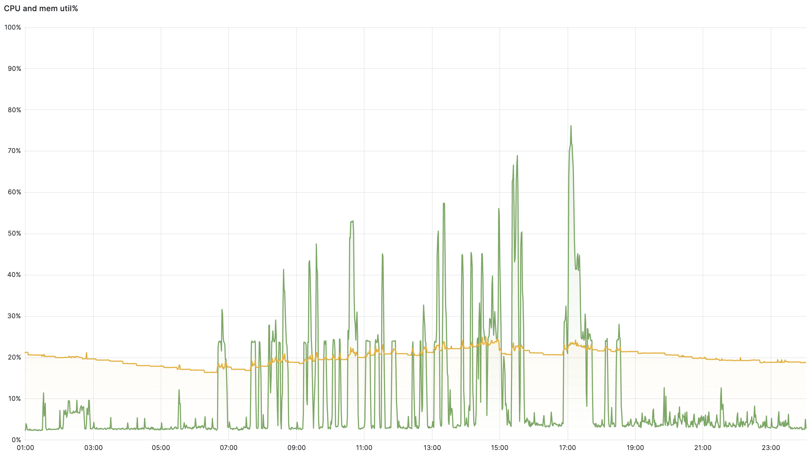
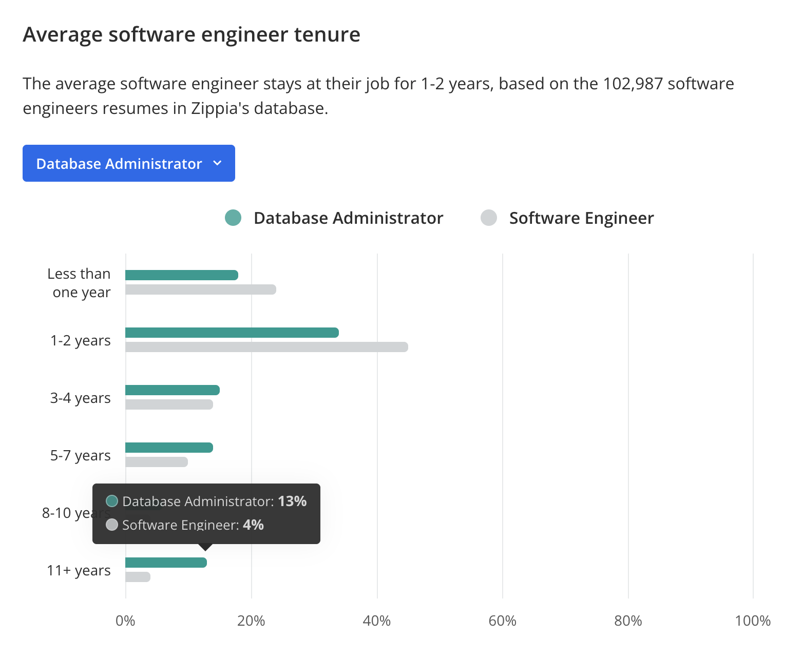
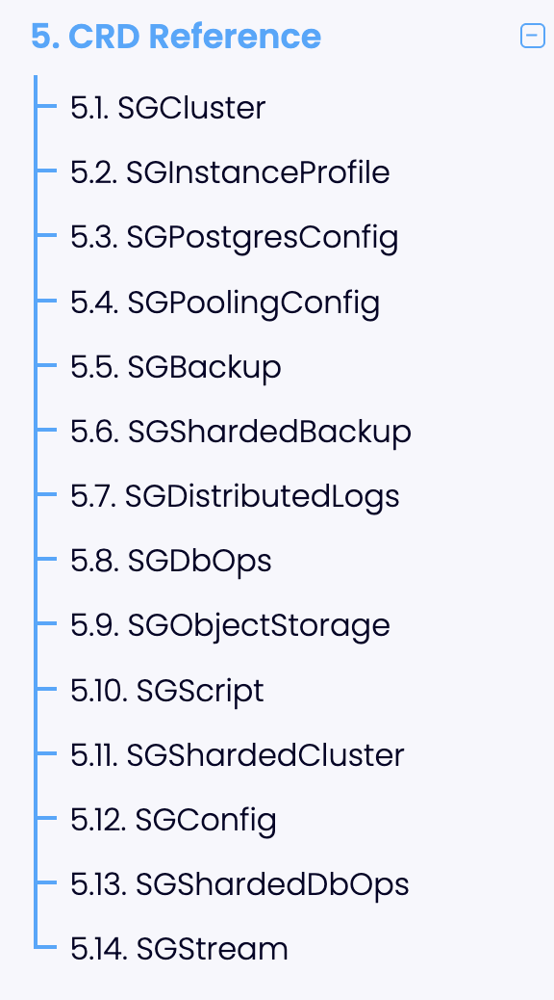
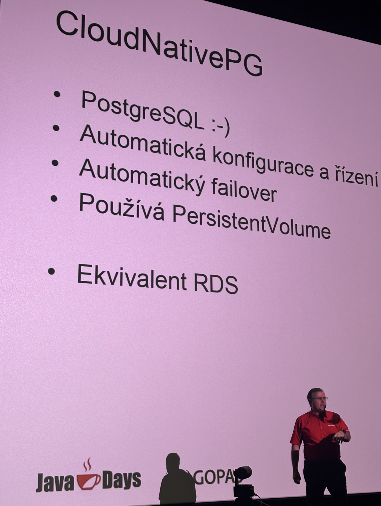
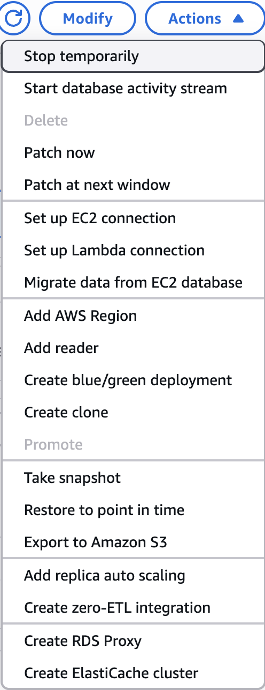

<!-- 

  Abstract:
  They told us, “Don’t run databases on Kubernetes.” We heard, “Challenge accepted.” This is the story of how we went from handcrafted Postgres chaos to a stable, CNCF-aligned DBaaS using CloudNativePG over the years — and lived to tell the tale.
  We started with containers, then pinned nodes in Kubernetes (spoiler: not scalable). Zalando’s operator with Patroni got us partway, but the real leap came with CloudNativePG: rebuilt from scratch, capable of autopilot.
  You’ll hear real incidents (yes, including “the one with the wrong PVC”), lessons learned, and how we’ve moved from tickets to self-service via GitOps. So what happens when YAML becomes your new DBA?
  This is a story of maturity, simplicity, real benefits CNCF brings to your project. Not just from a single project, but from the whole ecosystem evolving over the years in networking, deployment, and much more.
  Whether you're building a platform or escaping vendor lock-in, come laugh, learn, and reconsider running DBs in Kubernetes.

  Benefits to the ecosystem:
  This session offers a practical, vendor-neutral case study of running PostgreSQL on Kubernetes using CNCF-native tooling and shifting mindset along the way. Attendees will gain real-world insights into using CloudNativePG for production workloads, including lessons from failures, operational wins, and architecture trade-offs. By showing how a DIY journey evolved into a sustainable, operator-managed DBaaS, the talk empowers platform teams to adopt stateful workloads more confidently. It also helps drive awareness and adoption of CNCF projects, promotes GitOps best practices, and encourages open-source contributions to ecosystem tooling.

  Format: Solo presentation 25 mins
  Conference: CNCF-hosted Co-located Events North America 2025 in 31 days
-->

# YAML Is My DBA Now
# Our Postgres Journey from DIY to Autopilot Self-Service

David Pech
2025

---

<!-- paginate: true -->

# David Pech


---

# Question
# Do you consider running your databases in Kubernetes boring?

---

<style scoped>
h1 {
  color: lightblue;
}
</style>

# Peaks max at 50-60% of capacity




---

# Question
# Is PostgreSQL suited to run in a container?

---

PostgreSQL is not designed to be run in an dynamic env much (by design)

- some start-up config can't be changed (`max_connections`, `shared_buffers`)
- `extension_control_path` (PG18)

Example: you can promote to leader online, but demotion needs restart

---

# Question
# DB Uptime at least 99.999?
(26s downtime per month)

---

A candidate's resume:

>  ... after finishing project we achieved 0% of DB downtime on infra level ...

Reality check: typically no more >20s of downtime when doing a DB switchover.


<!--
---

# Question
# Does a typical developer understands his DB performance well?

(What he/she thinks?)

---

Especially if DB is sharded on application layer and use-cases change per-tentant (SaaS)
-->

---

# Question
# How many DBs require (any) DB-level tuning?

---

How many DBs can a DBA handle? **40:1** (2010)
[link](https://www.forrester.com/blogs/10-09-30-how_many_dbas_do_you_need_support_databases/)

**One DBA per 40 database** instances or per 4 terabytes of data (2019)
[link](https://www.reddit.com/r/SQLServer/comments/d2w5f6/dbas_how_many_environments_do_you_support/)

DBA-to-developer ratio should not be less than **1:200** (2024)
[link](https://www.bytebase.com/blog/how-many-dbas-should-a-company-hire/)

---



---

# Natural motivation for having Postgres in K8s
- align PostgreSQL runtime with all other applications
- allow developers themselves to manage small clusters

---

# My personal PG journey:
- single instance VM
- single instance Docker container
- multiple VMs with Patroni
- (some dead-ends dreaming about next steps)
- (more dead-ends)
- Zalando PG Operator
- CloudNativePG

---

# Single instance VM

- Reasonable decision on H-A :white_check_mark:

## But DIY!
- Hidden complexities all over the place

-> "just PostgreSQL is not enough"
-> DBA required for anything non trivial

---

# Docker time!

Dockerized vs. VMs

Libc problems
- tooling not included, DIY

Small benefit from VM

---

# Docker revelations

- Performance penalty :bomb:
- Containers restart all the time :pushpin:
- Split microservice DBs to multiple servers? :triangular_ruler:

---

# PostgreSQL containerized on any node?

- visible benefit with nodes pinned to disk/node?

- Docker Swarm app era
- PG container can't handle the orchestration

-> no, revert to VMs with Patroni

---

# Dead ends - Let's bring PostgreSQL into container, 2nd attempt

Spilo project (too many knobs, multiple PG versions, ...)

Benefit - questionable (?) for non-expert

Feels like having a Swiss knife for building a house.
:palm_tree: :arrow_right: :office:

---

# More dead ends - what are we gonna loose with Kubernetes?

- Snapshotting
- "Fine-grained" lifecycle control
- Major version upgrades?

(Stability, Performace already not a problem since Docker times)

---

# Core PostgreSQL vs. "Product"

```
Core Postgres

  Backup & Restore
  WAL store

    RBAC

    Monitoring (exporter)
    H-A, automatic repair

      Connection Pooling
      CDC
```

---

# PG Community is very opinionated

> We just want to run the Postgres and don't care about it.

If something breaks, we'll research how to fix / improve it.

IMHO: There are already too many opinions on how to run Postgres and which tools to use.


<!-- TODO: remove?

PostgreSQL management

- predefined users? (Script)
- backup and restore? (Scripts)
- monitoring? Supported!

---

Typical use-cases:

- refresh QA environment DBs
- verify DisasterRecovery
- semi-manually manage accounts and permissions
-->


---

# First K8s operators

Zalando PG Operator, PGO, StackGres

-> lift-n-shift Patroni
-> at first covered that PG was alive and in cluster

---

# Problem

# Pod construction - Patroni vs. PG in probes

Inside of VMs: Patroni runs next PG (systemd slices)

---

# Finding "just the right amount of YAML"

- Cluster definition, config options
- Users and DB declarative management

- Backups and WAL transfer

- Bootstrap / creation logic?

---

```yaml
apiVersion: "acid.zalan.do/v1"
kind: postgresql
metadata:
  name: acid-minimal-cluster
spec:
  ...
  users: # <-- USERS GO HERE
    # database owner
    zalando:
    - superuser
    - createdb

    # role for application foo
    foo_user: # or 'foo_user: []'

  #databases: name->owner
  databases:
    foo: zalando
```

---

```yaml
apiVersion: postgres-operator.crunchydata.com/v1beta1
kind: PostgresCluster
metadata:
  name: hippo
spec:
  ...
  backups: # <-- BACKUPS GO HERE
    pgbackrest:
      configuration:
        - secret:
            name: hippo-pgbackrest-secrets
      global:
        repo1-cipher-type: aes-256-cbc
      repos:
        - name: repo1
          volume:
            volumeClaimSpec:
              accessModes:
                - 'ReadWriteOnce'
              resources:
                requests:
                  storage: 1Gi
```

---

# There is never too much of YAML!



---

```yaml
apiVersion: stackgres.io/v1
kind: SGDbOps
metadata:
  name: benchmark
spec:
 sgCluster: my-cluster
 op: benchmark
 maxRetries: 1
 benchmark:
   type: pgbench
   pgbench:
     databaseSize: 1Gi
     duration: P0DT0H10M0S
     concurrentClients: 10
     threads: 10
   connectionType: primary-service
```

---

# Problem
# Lost block device-level backups (snapshots)

- Main DR method

Fixed: VolumeSnapshot 
[Beta in 1.17] (2019)

---

# Problem
# Snapshotting multiple volumes at once lost 

Fixed: VolumeGroupSnapshot
[Beta in 1.32] (2024)

---

# Problem
# Restart DB without reconnecting users

pgbouncer and orchestration around

---

# Problem
# Changing the most configs on the fly without restarting leader

Not fixed (PG's nature)

---

# 2nd generation of operators

CloudNativePG

Short story - made from scratch

---

[Bug]: Split-brain in case of network partition [#7407](https://github.com/cloudnative-pg/cloudnative-pg/issues/7407)

> - Identify the primary node and disconnect it from the network using docker network disconnect kind kind-worker-xxx
> - Observe that CNPG promoted a new primary node.
> - Bash into the old primary node using docker exec, and bash into the postgres pod inside the node. Postgres on this node is still primary.

> This is a typical split brain. Any workload that origins from the same VM (e.g., pod is on the same node as the old primary) can generate writes to the old primary.


---

> TL;DR: After version 1.26.0, I believe we should evaluate submitting a draft pull request with a proposed solution in CNPG on the same path as Patroni, allowing us to receive early feedback and potentially include the feature in version 1.27.

...

> v1.27: Primary Isolation Check — Now Stable
The liveness pinger, introduced experimentally in 1.26, is now a stable feature. With .spec.probes.liveness.isolationCheck enabled by default, the liveness probe now performs primary isolation checks to improve detection and handling of primary connectivity issues in Kubernetes environments.

---


---

# Why is it acceptable?

- Companies with 1,000+ engineers (5+ DBAs):
  Top 1-2% of tech companies

- Companies with 500+ engineers (2+ DBAs):
  Top 3-5% of tech companies

- Companies with 100+ engineers (0.5 DBA):
  This represents roughly the top 10-15% of tech companies 

- All others -> 0-1 DBA

---

# Random KubeCon London conversation (SRE perspective):

> ... we run a lot of multi-master MySQL clusters in Kubernetes and just time to time they have a split brain. They can typically recover manually quickly, we also have tested backups...

> Me: Are you kidding? Why do you tolerate this?

> Well, there are just a few SREs and many (e.g. dozens of DBs) and we need to solve real problems.

---

# Developer perspective

2025-10
JavaDays, Prague, CZ

> CloudNativePG as "RDS equivalent"?



<!--
---

# CloudNativePG == Amazon RDS

as seens by some developers
-->

---

# What do we really expect from our DBA?

> "Autopilot" DBaaS with very simple interface for complex tasks



---

# Mixture of declarative and imperative approach

Example: blue-green RDS is not in declarative Terraform [but...](https://hashicorp.github.io/terraform-provider-aws/design-decisions/rds-bluegreen-deployments/)

Very annoying for some, but it's much more to use the right tool for the job.

---

# What does this mean for your DBaaS platform

GitOps can get you 90% of the way.

You still need to figure out how to issue imperative commands.

[VACUUM FULL / CLUSTER CONCURRENTLY](https://commitfest.postgresql.org/patch/5117/)

---

<!-- 
# Do some "typical technical PG problems" still matter?

TODO: vynechat tento slide?

Slow query without any index?

TODO: surprising

---
-->

# Problem

# Basic memory tuning based on Pod size not being done

- `shared_buffers`
- `work_mem`

Why not if other DBs do it at least to some extent?

---

# Problem

# No smart PG GUCs (configs) tuning based on the logs / metrics?

- autovacuum
- maintenance
- ...

Our Oracle did it back in the day...

---

# Problem

# Best-practises in monitoring?

Too many recipes, too many cooks.
<!-- 
TODO: screenshot wrike dashbaord

TODO: comment from postgres.fm
-->

---

# Summing up

Originally: A seasoned DBA was managing VMs. He/She couldn't have a vacation.

:arrow_heading_down:

And now: Now you have at least 3 SREs / Platform Engineers running your DBaaS. You pay for their vacations.

> But they also operate 10-20 different CNCF projects just to keep DBaaS running

---

# Summing up

Originally: A lot of custom scripts for bootstrapping and majority of 2nd day ops.

:arrow_heading_down:

And now: You declare the expected state. Operators can take your DBs there.

> This is a good thing!

---

# Summing up

Originally: Any serious production meant hiring at least some DBA support.

:arrow_heading_down:

And now: Many teams believe in the operator which can nowadays operate DB instance very autonomously. Many teams are very surprised that PG expertise is a must once they reach non-trivial scale.

> My personal observation.

---

# Summing up

Originally: Developers don't understand Postgres internals well.

:repeat:

This won't change.

---

# "Almost there myth"

In fact DB creation and basic management is so easy with operators

But thinking that YAML is your DBA is just a fallacy.

Could the operators help even more in the future?

<!-- TODO: QR >